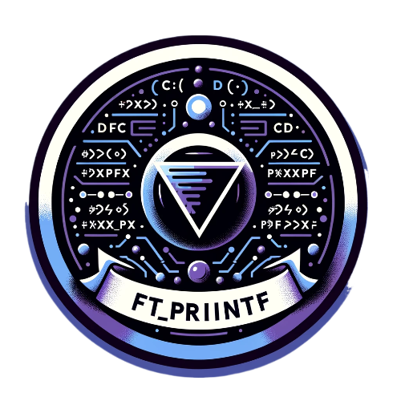
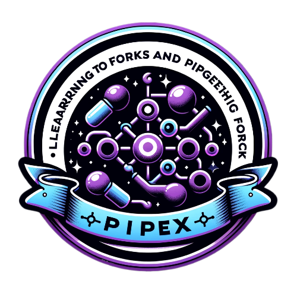
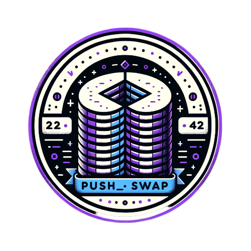

# Jeremy's 42 School Project Portfolio

Welcome to my repository where I've curated projects completed during my time at [42 School Singapore](https://www.42singapore.com). Each project folder is a testament to the skills and knowledge I've developed in my coding journey.

## Projects Overview

Here, you'll find a variety of projects ranging from simple algorithms to complex software solutions. These projects demonstrate my proficiency in software development and my ability to tackle challenging problems.

* 

		
	  
	Circle 1
	  
	
	
	
      
	Circle 2
	  
	
	
	
      
	Circle 3
	  
	
      
	Circle 4
	  

## Skills

Throughout these projects, I've developed a strong set of skills, including:

- Programming Languages: C, Python, JavaScript, etc.
- Frameworks & Technologies: Docker, Git, Unix, etc.
- Problem-Solving and Critical Thinking
- Collaborative development and Peer Learning

## Connect with Me

I'm always open to discussing technology, coding, and innovation. Feel free to connect with me on [LinkedIn](Your-LinkedIn-Profile-Link).

## Acknowledgements

A special thanks to all the staff and students at 42 Singapore for providing an innovative and challenging environment that has helped me grow as a developer. Visit [42 Singapore](https://www.42singapore.com) to learn more about their program and methodology.

## How to Navigate

Each project directory contains the following its own README which explains in  detail on what the project is about.

## Contribution

While these projects are primarily for showcasing my work, I'm open to suggestions and contributions. If you see an area for improvement, feel free to create an issue or submit a pull request.

