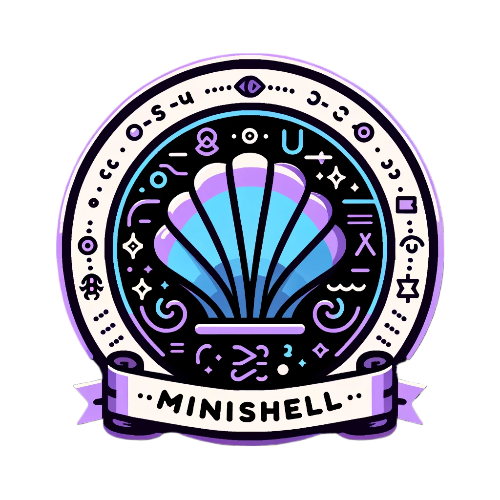

# Jeremy's 42 School Project Portfolio

Welcome to my repository where I've curated projects completed during my time at [42 School Singapore](https://www.42singapore.com). Each project folder is a testament to the skills and knowledge I've developed in my coding journey.

## Projects Overview

Here, you'll find a variety of projects ranging from simple algorithms to complex software solutions. These projects demonstrate my proficiency in software development and my ability to tackle challenging problems. Note that every project includes a bonus that provides 25 marks on completion only if the base project has scored 100/100.

| Project|Description |
| --- | --- |
|  | **[LIBFT](https://github.com/JeremyChooCK/42-Core-SG/tree/main/libft)** - 125/100   This project involves writing out your very own C library.   Skills: Pointers, Memory manipulation, Structures, Linked lists.  External functions: write, malloc, free |
|  | **[FT_PRINTF](https://github.com/JeremyChooCK/42-Core-SG/tree/main/ft_printf)** - 100/100   This project recreates the printf function.   Skills: Variadic functions.  External functions: malloc, free, write, va_start, va_arg, va_copy, va_end |
|  | **[GET_NEXT_LINE](https://github.com/JeremyChooCK/42-Core-SG/tree/main/get_next_line)** - 125/100   This project creates a function to return a line sequentially.   Skills: file descriptors, static variables, memory use and management.  External functions: read, malloc, free |
|  | **BORN2BEROOT** - 100/100   This project involves setting up a server.   Skills: System Configuration, SSH, FTP, Port Forwarding, Web Hosting |
|  | **[PIPEX](https://github.com/JeremyChooCK/42-Core-SG/tree/main/pipex)** - 100/100   This project recreates the PIPE function in Linux.   Skills: File Descriptors, I/O manipulation, Multi-Process Handling, Forks.  External functions: open, close, read, write, malloc, free, perror, strerror, access, dup, dup2, execve, exit, fork, pipe, unlink, wait, waitpid |
|  | **[FRACT-OL](https://github.com/JeremyChooCK/42-Core-SG/tree/main/fract-ol)** - 125/100   This project involves graphical libraries to plot fractals.   Skills: Event listeners, Minilibx, Structures, Complex Numbers.  External functions: open, close, read, write, malloc, free, perror, strerror, exit, math library, minilibx |
|  | **[PUSH_SWAP](https://github.com/JeremyChooCK/42-Core-SG/tree/main/push_swap)** - 85/100   This project sorts a stack of numbers with limited actions.   Skills: Sorting Algorithms.  External functions: read, write, malloc, free, exit |
|  | **[PHILOSOPHERS](https://github.com/JeremyChooCK/42-Core-SG/tree/main/philosophers)** - 100/100   This project is based on the dining philosophers problem using multi-threading and mutexes.   Skills: Multi-threading.  External functions: memset, printf, malloc, free, write, usleep, gettimeofday, pthread_create, pthread_detach, pthread_join, pthread_mutex_init, pthread_mutex_destroy, pthread_mutex_lock, pthread_mutex_unlock |
|  | **[MINISHELL](https://github.com/JeremyChooCK/42-Minishell)** - 100/100   This project involves writing a shell.  External functions include readline, rl_clear_history, rl_on_new_line, and many others. |

## Skills

Throughout these projects, I've developed a strong set of skills, including:

- Programming Languages: C, Python, JavaScript, etc.
- Frameworks & Technologies: Docker, Git, Unix, etc.
- Problem-Solving and Critical Thinking
- Collaborative development and Peer Learning

## Connect with Me

I'm always open to discussing technology, coding, and innovation. Feel free to connect with me on [LinkedIn](https://www.linkedin.com/in/jeremy-choo-3a7b2522a/).

## Acknowledgements

A special thanks to all the staff and students at 42 Singapore for providing an innovative and challenging environment that has helped me grow as a developer. Visit [42 Singapore](https://www.42singapore.com) to learn more about their program and methodology.

## How to Navigate

Each project directory contains its own README which explains in detail what the project is about.

## Contribution

While these projects are primarily for showcasing my work, I'm open to suggestions and contributions. If you see an area for improvement, feel free to create an issue or submit a pull request.
